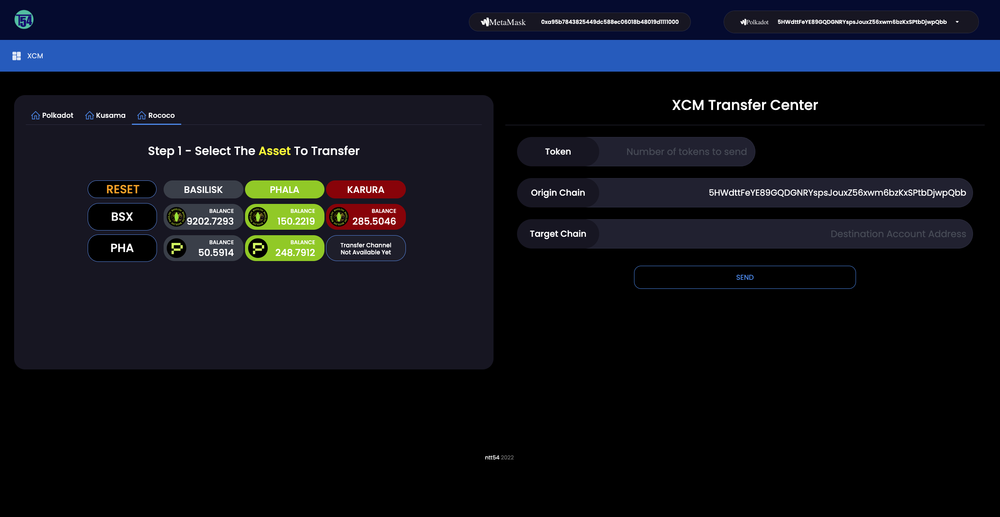
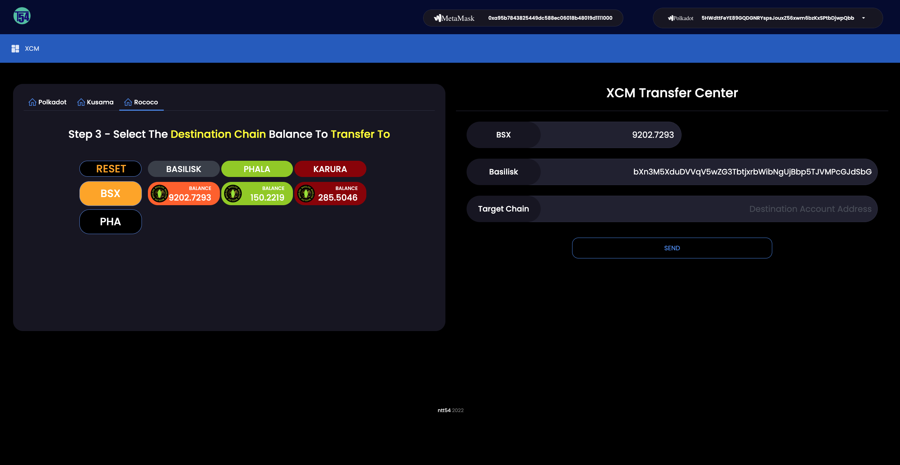
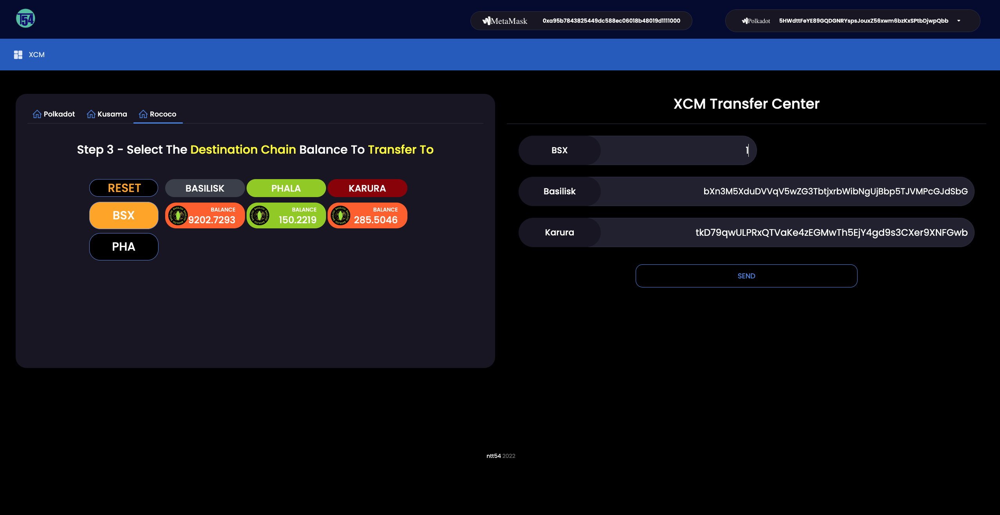
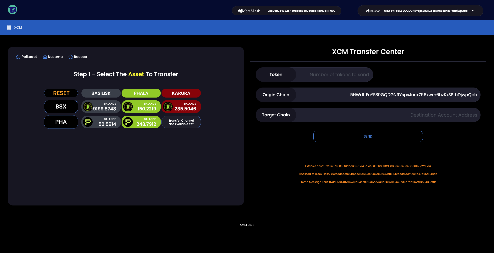

## Please use at your own risk. This a submission for bounty, not production/battle-tested and audited software.

<br>

## Table of Contents
1. [General Info](#general-info)
2. [Website](#website)
3. [Demo Video](#demo-video)
4. [Installation](#installation)
5. [Using the Front End](#using-the-front-end)
6. [Technical](#technical)
### General Info
***
<p>This repo contains software that allows the user to experiment and make XCM transfers in the Rococo testnet environment.</p>
<p>Futhermore, it contains detailed code in regards to functions, objects and setups to show any developer which functions have to be called and how XCM transfers can be expanded across more parachains and assets.
</p>
<p>
At the time of writing this software although HRMP channels have been opened between Basilisk and several parachains, there has not been a token generation event and therefore it was not possible for us to develop on Kusama/Polkadot for Basilisk/HydraDX.
</p>
<p>
To enable ongoing development the Basilisk team provided an environment of three parachains on the Rococo testnet.

These were Basilisk, Karura and Phala along with their respective faucet tokens so we could develop and conduct XCM transfers.
</p>
<p>
In addition to a user interface that allows Rococo XCM transfers, we have added a fully functioning User Interface for the Kusama ecosystem which we developed for another bounty as well. It is a natural fit to have all ecosystems within the same user interface. This also smoothens the transition for developers from the Rococo testnet to the Kusama mainnet and also expands further on showing how more parachains and assets can be easily added. 
</p>
<br>

### Website
***
<p>
We have deployed a website at 
<a href="https://intense-escarpment-02481.herokuapp.com" target="_blank">here</a>
to showcase our software and bounty application.
</p>
<p>
Please make sure you have the Polkadot wallet chrome extension installed.
</p>
<p>
Please make sure you also have the Metamask wallet chrome extension installed and connected to the Moonriver parachain if you want to use the Kusama ecosystem UI.
</p>
<p>
The website is best viewed on screen resolutions above 2560x1440px. 
Any future versions will accomodate responsive frameworks + mobile.
</p>
<br>

### Demo Video
***
<p> A demo video can be found at ******** TODO ******** </p>
<br>

### Installation
***
Create a new folder and inside it
```bash
$ git clone https://github.com/Entity54/AmsterDOT_Basilisk_CrossChainTransfer
$ cd AmsterDOT_Basilisk
$ yarn
$ npm start
```

<br>

### Using the Application
***
<p>
Welcome to ****
<p>
To begin with you must ensure you connect and approve the Polkadot.js and Metamask extension pop ups when interacting with this website. 

Please also ensure that Metamask is connected to the Moonriver chain. 

For Rococo the Metamask wallet is not used.
</p>
<p>
You can see the Polkadot and Metamask accounts to be used at the top of the screen. 
If another Polkadot account is desired, please choose from the top right dropdown (and for metamask choose directly within your metamask extension).
</p>
<p>
Upon visiting the DApp, you can see that the screen is divided into two main sections:

* The left side of the screen is where all of the instructions and choices are made by the user.
* The right side of the screen is where all of the required transaction information is automatically prefilled before the transaction is eventually submitted.
<p>
<br>
As soon as the accounts are connected, the balances of these accounts are loaded and displayed across all assets and parachains.
</p>
For example, looking at the BSX asset in the first column, reading across that row, we can see our BSX balance on the Basilisk chain, the Phala chain and the Karura Chain.
<p>

<br>
<p>Lets try our first XCM transaction. </p>
<br>


<br>

<br>
<p>
Choose an asset from the first column e.g. BSX. 

This will be highlighted in orange and only the row of that asset will remain visible to emphasize the next available options. 

On the right side of the screen the "Token" field is automatically prefilled with your selection, "BSX".
</p>
<br>


<br>

<p>
Next, select the origin chain that you want to transfer the BSX "from", for example Basilisk. This is now also highlighted in orange.

On the right side of the screen:
* The "Origin Chain" field is automatically prefilled with the selection, "Basilisk".
* The correct address format of the user's substrate account for the chosen origin chain is prefilled. 
* The maximum available balance of the selected asset at the chosen Origin chain is prefilled in the quantity field. The user can of course edit this if they wish to transfer a different amount.

We will send 1 BSX.

Meanwhile on the left side of the screen, a check is made and the remaining tabs on the row of the selected asset will only remain visible depending on whether the relevant HRMP channel is available or not to transfer the selected asset.
The reason for this is that currently some parachains do not support receiving "secondary" or "non-native" assets. 
</p>
<br>


<br>
<p>
Next, select the destination chain you want to transfer the BSX "to", for example, lets choose Karura. This tab is now also highlighted in orange.

On the right side of the screen:
* The "Destination Chain" field is automatically prefilled with the selection, "Karura".
* The correct address format of the user's substrate account for the chosen destination chain is prefilled.
* The user can of course choose to send their asset to any address but as a default this is prefilled with their own address at the destination parachain.
</p>
<br>


<br>
<p>
Note: If the user clicks again or clicks "Reset" the webpage will reset to the initial configuration.
</p>

<br>
<p>
That's it! 

Click Send and sign the transaction when the Polkadot Wallet Extension appears.
</p>
<br>


<br>
<p>
The user is immediately notified that the XCM transfer has been submitted.
</p>

<br>
<p>
As soon as the Origin and Destination parachains mine the relevant transactions, the origin chain Extrinsic Hash, Block Hash and XCMP message are displayed on the screen.
</p>
<p>
Lastly, on the left you can see the transfer of assets as the balances on the different parachains are updated.
</p>
<br>


<br>

> TIP: How about making an exotic XCM transfer, like transferring BSX from Karura to Phala !!!

<br>
<br>
<br>


# Technical
 

## Supported Chains and Assets
***
### __Rococo__
1. __Parachains__ 
    * Basilisk
    * Phala
    * Karura
2. __Assets__
    * BSX
    * PHA

<br>

## Setup.js
<p>
The core of the code that handles functions to build and submit XCM transfers along with the logic for setting up Routes and APIs resides at Setup.js
<br>
This is then called from App.js and the front end UI components.
</p>
<br>

## Setting up the APIs

<br>
<p>At App.js Lines we find the code that calls Setup.js to setup the parchain rpcs. </p>

__App.js Lines 165 to 175__ 
```js
const { api: api_Rococo_Karura } = await setup_SubstrateChain("Rococo_Karura");
// console.log("api_Rococo_Karura: ",api_Rococo_Karura);
setApi("Rococo_Karura", api_Rococo_Karura);

const { api: api_Rococo_Basilisk } = await setup_SubstrateChain("Rococo_Basilisk");
// console.log("api_Rococo_Basilisk: ",api_Rococo_Basilisk);
setApi("Rococo_Basilisk", api_Rococo_Basilisk);

const { api: api_Rococo_Phala } = await setup_SubstrateChain("Rococo_Phala");
// console.log("api_Rococo_Phala: ",api_Rococo_Phala);
setApi("Rococo_Phala", api_Rococo_Phala);
```

<br>
<p>At Setup.js we create the api rpc connections and store these in variables to be used for submitting transactions to the relevant parachains.</p>

__Setup.js Lines 2295 to 2328__ 
```js
const setup_SubstrateChain = async (wsURL = 'MoonbaseAlpha') => {
  console.log("setup_Moonbeam is RUN");

  let WS_URL;
  //mainnet
  if (wsURL === 'Moonriver')     WS_URL = 'wss://wss.moonriver.moonbeam.network'; 
  ...
  //testnets
  ...
  else if (wsURL === 'Rococo_Phala')         WS_URL = 'wss://rhala-api.phala.network/ws'; 
  else if (wsURL === 'Rococo_Basilisk')      WS_URL = 'wss://rpc-01.basilisk-rococo.hydradx.io'; 
  else if (wsURL === 'Rococo_Karura')        WS_URL = 'wss://karura-rococo.aca-dev.network'; 

  const wsProvider = new WsProvider(WS_URL);

  // Wait for Provider
  const api = await ApiPromise.create({ provider: wsProvider });
  await api.isReady;
  console.log(`api => : `,api);
  return {api};
};
```
<br>
<p>Storing apis into variables</p>

__Setup.js Lines 20, 28 to 52__ 

```js
let Rococo_RhalaApi, Rococo_BasiliskApi, Rococo_KaruraApi;

const setApi = (apiName, api) => {
  if (apiName==="Kusama") KusamaApi = api;
  ...
  else if (apiName==="Rococo_Phala")    { Rococo_RhalaApi    = api; apiObj["r2004"] = api; }
  else if (apiName==="Rococo_Basilisk") { Rococo_BasiliskApi = api; apiObj["r2090"] = api; }
  else if (apiName==="Rococo_Karura")   { Rococo_KaruraApi   = api; apiObj["r2000"] = api; }
}

const apiObj = {
                "2000" : null,
                "2023" : null,
                "2092" : null,
                "2004" : null,
                "2090" : null,
                "2007" : null,
                "r2004" : null,
                "r2090" : null,
                "r2000" : null,
               }
```

> TIP: For any new parachain we want to add, we need the relevant WS_URL and the parachain code which can be obtained from here:
 [https://polkadot.js.org/apps/?rpc=wss%3A%2F%2Fkusama.public.curie.radiumblock.co%2Fws#/parachains](https://polkadot.js.org/apps/?rpc=wss%3A%2F%2Fkusama.public.curie.radiumblock.co%2Fws#/parachains)
<br>

<br>

## Setting up the Assets

<br>
<p>For each asset we want to XCM transfer we need to know certain specifications.</p>
<p> The type of specifications varies dependent on which parachain this asset is the native token.</p>
<p> Some examples of type of specification are the GeneralKey of the asset, the Pallet Id of the asset or the u128 id of the asset. This is entirely dependant on how the parachain has setup its own version of xcm pallet.</p>
<p>For Rococo and these parachains we will focus on the GeneralKey of the asset.</p>

<p>General Keys of assets and asset's native parachain:</p>

__Setup.js Lines 53 to 65__ 
```js
const generalKeyWithout_0x = {
                              "KAR"  : "0080",
                              "BSX"  : "00000000",
                              "PHA"  : "N/A",
                               ...
                             };
const tokenBirthChain     = {
                              "KAR"  : 2000,
                              "BSX"  : 2090,
                              "PHA"  : 2004,
                              ...
                             };     
```

> TIP: For any new asset go to its native parachain URL or other parachain URL that supports the asset for XCM transfers and within Developer>Chain state> modules asset information about its GeneralKey or Pallet instance or Currency id can be found. 
Here is an example for BSX having GeneralKey: 0x00000000 that can be found at the Karura Rococo in the assetRegistry>foreignAssetLocations 
 [https://polkadot.js.org/apps/?rpc=wss%3A%2F%2Fkarura-rococo.aca-dev.network#/chainstate](https://polkadot.js.org/apps/?rpc=wss%3A%2F%2Fkarura-rococo.aca-dev.network#/chainstate)
<br>

<br>


## Setting up Routes  

<p>Moving over to ntt54_QuickTrade.js file we can find object xcmRoutes.</p>
<p>
In this object we set up the routes that define the available origin and destination parachains for each asset. This acts as a map to see what xcm transfers are possible.
</p>
<p>
For example for asset "BSX" we can see that when the origin chain is Basilisk it can be transferred to Karura or Phala.
</p>
<p>
In a more exotic XCM transfer we can see that BSX can be transferred from an account in Karura to Phala and vice versa
</p>


__ntt54_QuickTrade.js Lines 16 to 64__ 
```js
const xcmRoutes = {
...
"PHA": {
            "Phala"    : ["Karura", "Moonriver", "Basilisk"], 
            "Karura"   : ["Phala", "Moonriver"],
            "Moonriver": ["Phala", "Karura"], 

            "Basilisk" : ["Phala"], 
            },
...
"BSX": {
            "Basilisk" : ["Karura", "Phala"], 
            "Karura"   : ["Basilisk","Phala"],      
            "Phala"	   : ["Basilisk","Karura"], 
            }
};
```


<br>

## Setting up parachainCodes and tokens in the tokenList

<p>Each parachain has a unique id number. This helps us identifying the location of its native asset but also to point as the destination parachain in an XCM transfer. If a new parachain needs to be added then the relevant parachain code needs to be added to the parachainCodes object</p>
<p>Any new asset needs to be added to the tokenList
</p>


__ntt54_QuickTrade.js Lines 68 to 83__ 
```js
const parachainCodes = {   
    //mainnets
    Moonriver: 2023,   
    Karura   : 2000,
    Kintsugi : 2092,
    Phala    : 2004,
    Basilisk : 2090,
    //testsnets 
    MoonbaseAlpha   : 1000,
    KaruraAlphanet  : 2000,
    Karura_Rococo   : "r2000",
    Rhala_Rococo    : "r2004",
    Basilisk_Rococo : "r2090"
}	
						
const tokenList = ["KSM","KAR","AUSD","KINT","KBTC","PHA","MOVR","BSX"];
```

<br>


## Functions to call for XCM transfers
<p>Within ntt54_QuickTrade.js and the transferBalance function, we can find all relevant functions to be called for all supported assets and routes.
</p>
<p>Focusing on transfers of BSX the relevant lines are from 1408 to 1556 covering all supported routes for transfering BSX.
</p>
<p>
When sending BSX via XCM from Basilisk to another parachain there are many functions supported reflecting the functions found in the xTokens pallet module.
</p>
<p>
Below we can see 6 different ways of transfering BSX from Basilisk to Karura:
</p>

```js
//Alternative Method1 *** tranfer ***/
rococo_transfer_currency("BSX", parachainCodes.Karura, sendToAddress, amount)

//Alternative Method2 *** tranferWithFee ***/
rococo_transfer_currencyWithFee("BSX", parachainCodes.Karura, sendToAddress, amount, 1)

//Alternative Method3 *** tranferMultiCurrencies ***/
rococo_transfer_multiCurrencies("BSX", parachainCodes.Karura, sendToAddress, amount)

//Alternative Method4 *** tranferMultiAssets ***/
rococo_transfer_MultiAssetS_FromParachainToParachain("BSX", parachainCodes.Basilisk_Rococo, parachainCodes.Karura, sendToAddress, amount)

//Alternative Method5 *** tranferMultiAssetWithFee ***/
rococo_transfer_MultiAssetWithFee_FromParachainToParachain("BSX", parachainCodes.Basilisk_Rococo, parachainCodes.Karura, sendToAddress, amount, 1)

//Alternative Method0 *** tranferMultiAsset ***/
rococo_transfer_Asset_FromParachainToParachain("BSX", parachainCodes.Basilisk_Rococo, parachainCodes.Karura, sendToAddress, amount)
```

<br>
<p>
The standard function we prefer for its simplicity and generic use, is the last one:

Method0(rococo_transfer_Asset_FromParachainToParachain)

in which the user provides the asset "BSX, the origin parachain code, destination parachain code, the account to send BSX to, and the amount.

```js
rococo_transfer_Asset_FromParachainToParachain("BSX", parachainCodes.Basilisk_Rococo, parachainCodes.Karura, sendToAddress, amount)
```
</p>

<br>
<p>
In Method5(rococo_transfer_MultiAssetWithFee_FromParachainToParachain) the only difference is we also define the fees to transfer.
</p>
<p>
In Method4(rococo_transfer_MultiAssetS_FromParachainToParachain) and Method3 (rococo_transfer_multiCurrencies) we can expand and send multiple assets or currencies with only one XCM transaction but also defining which of these assets will be the one to pay fees at the destination parachain.
<br>Note: When using these functions we need to know what assets are eligible to pay the fees at the destination parachain.
</p>
<p>
Method1(rococo_transfer_currency) is the simplest of all to use, as only the destination parachain code, account to send BSX to, and amount are required.
</p>
<p>
Method2(rococo_transfer_currencyWithFee) is very similar to Method1(rococo_transfer_currency) but with the added argument of stating the fees we want to pass along with the XCM transfer.
</p>

> TIP: Find the code block below and comment  rococo_transfer_Asset_FromParachainToParachain and uncomment any other Method to see the XCM transaction.

<br>

__ntt54_QuickTrade.js Lines 1408 to 1556__ 
```js
//#region baseCurrency BSX
...
else if (baseCurrency==="BSX")
{
    if (orginChain==="Basilisk" && targetChainDestination==="Phala")
    {
        ...
    }
    else if (orginChain==="Basilisk" && targetChainDestination==="Karura")
    {
        console.log(`We are sending BSX from Basilisk to Karura inputTranferAmount:${amount} sendToAddress:${sendToAddress}`);
        setTransfer_IsSubmiting(true);
        setTransactionMessage(`Transfer BSX from Basilisk to Karura, submitted.`);

        // Equivalent for Kusama UI
        // transfer_Asset_FromParachainToParachain("BSX", parachainCodes.Basilisk_Rococo, parachainCodes.Karura, sendToAddress, amount)

        //Alternative Method1 *** tranfer ***/
        // rococo_transfer_currency("BSX", parachainCodes.Karura, sendToAddress, amount)

        //Alternative Method2 *** tranferWithFee ***/
        // rococo_transfer_currencyWithFee("BSX", parachainCodes.Karura, sendToAddress, amount, 1)

        //Alternative Method3 *** tranferMultiCurrencies ***/
        // rococo_transfer_multiCurrencies("BSX", parachainCodes.Karura, sendToAddress, amount)

        //Alternative Method4 *** tranferMultiAssets ***/
        // rococo_transfer_MultiAssetS_FromParachainToParachain("BSX", parachainCodes.Basilisk_Rococo, parachainCodes.Karura, sendToAddress, amount)

        //Alternative Method5 *** tranferMultiAssetWithFee ***/
        // rococo_transfer_MultiAssetWithFee_FromParachainToParachain("BSX", parachainCodes.Basilisk_Rococo, parachainCodes.Karura, sendToAddress, amount, 1)

        //Alternative Method0 *** tranferMultiAsset ***/
        rococo_transfer_Asset_FromParachainToParachain("BSX", parachainCodes.Basilisk_Rococo, parachainCodes.Karura, sendToAddress, amount)
        .then((resolveMsg) => {
            setTransactionMessage(
                    resolveMsg.map((msg, index) => {
                        return ( <p key={index}>{msg}</p> )
                    })
            );

            setTimeout(() => { getROCOCO_AllBalancesAndAccountFormats(polakdotAccountSigner.address, accountList[0]); },10000);
            setTransfer_IsSubmiting(false);
            setInputTranferAmount("");  resetAll();
        })
        .catch((rejectMsg) => console.log(rejectMsg));
    }
    else if (orginChain==="Phala" && targetChainDestination==="Basilisk")
    {
        ...
    }
    else if (orginChain==="Karura" && targetChainDestination==="Basilisk")
    {
        ...
    }
    else if (orginChain==="Karura" && targetChainDestination==="Phala")
    {
        ...
    }
    else if (orginChain==="Phala" && targetChainDestination==="Karura")
    {
        ...
    }

}
//#endregion
```

<br>

> TIP: To find the code with the actual extrinsics being prepared, signed and sent, look at Setup.js Lines 1500 to 2290. Inside these lines and for each function we can find all events emitted during an XCM transfer e.g. Lines 2251 to 2277 along with any thrown errors e.g. Lines 2230 to 2245.
<br>Since any of the Methods described above is a promise, when this resolves it returns a message with the Extrisnic Hash, Block Hash and XCMP message of the XCM transfer.

<br>


## Retrieving Asset Balances in parachains

<p>Once an XCM transfer promise, using any of the methods above, resolves we use the function getROCOCO_AllBalancesAndAccountFormats which takes as arguments the selected polkadot and metamask accounts and is situated at component DEX.js
</p>

__DEX.js Lines 48 to 93__ 
```js
const getROCOCO_BalancesAndAccountFormats = async (account, token=null, metamaskAccount=null, network=null ) => {
    console.log(`Getting ROCOCO account formats for account: ${account} and balance for token: ${token} metamaskAccount: ${metamaskAccount} for network:${network} (if null we get balances for all supported networks)`);
    const response = await getRococo_AvailableBalance(account, token, metamaskAccount, network);
    return response
}

...

const getROCOCO_AllBalancesAndAccountFormats = async (account, metamaskAccount) => {
    const basiliskResponse = await getROCOCO_BalancesAndAccountFormats(account, "BSX", metamaskAccount);
    if (basiliskResponse)
    {
        const {accounts, balances: balancesBSX} = basiliskResponse;
        const {balances: balancesPHA}           = await getROCOCO_BalancesAndAccountFormats(account, "PHA", metamaskAccount);
        // const {balances: balancesKAR}           = await getROCOCO_BalancesAndAccountFormats(account, "KAR", metamaskAccount);
        
        setAccountFormats(accounts);
        
        setRococoBalancesBSX(balancesBSX);
        setRococoBalancesPHA(balancesPHA);
        // setRococoBalancesKAR(balancesKAR);
        return { BSX:balancesBSX, KAR: null, PHA:balancesPHA,};
        // return { BSX:balancesBSX, KAR: balancesKAR, PHA:balancesPHA,};
    } else { console.log(`getROCOCO_AllBalancesAndAccountFormats Some API Sockets are not ready`); return }
} 
```


<br>
<p>
These functions call the function getRococo_AvailableBalance at Setup.js that retrieves balances for a given account and token across all supported parachains
</p>


__Setup.js Lines 2600 to 2690__ 
```js
const getRococo_AvailableBalance = async (account, token=null, metamaskAccount, network=null) => {
  ...
  const accounts = getAccountFormatsforAccountI32(account);
  const {basilisk_Address, karura_Address, khala_Address } = accounts;

  if (token.toLowerCase()==="bsx") 
  {
    const timestamp = await Rococo_BasiliskApi.query.timestamp.now();   

    //Basilisk
    const { nonce, data: balance } = await Rococo_BasiliskApi.query.system.account(basilisk_Address);   // Retrieve the account balance & nonce via the system module
    let BasiliskBalance = null;
    if (balance) 
    BasiliskBalance = Number( ethers.utils.formatUnits( (balance.free).toString(), 12) ).toFixed(4)

    //Karura
    const {free: free1 , reserved: reserved1, frozen: frozen1}  = await Rococo_KaruraApi.query.tokens.accounts(karura_Address, {ForeignAsset: 2});    
    const KaruraBalance = Number( ethers.utils.formatUnits( free1.toString(), 12) ).toFixed(4)
  

    // Phala
    const Phala_balanceObj = await Rococo_RhalaApi.query.assets.account( 5,  khala_Address ); 
    let PhalaBalance = null;
    if (Phala_balanceObj.toJSON()) 
    PhalaBalance = Number( ethers.utils.formatUnits( (Phala_balanceObj.toJSON()).balance, 12) ).toFixed(4);
    
    const balances = {token, timestamp: new Date(timestamp).toISOString, Basilisk: BasiliskBalance,  Karura: KaruraBalance, Phala: PhalaBalance };
    console.log(`ROCOCO =====> balances: `,balances);

    return {accounts, balances};
  }
  else if (token.toLowerCase()==="kar") 
  {
      ...
  }
  else  if (token.toLowerCase()==="pha") 
  {
      ...
  }
} 
```
